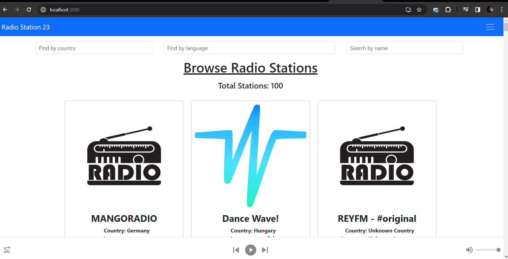
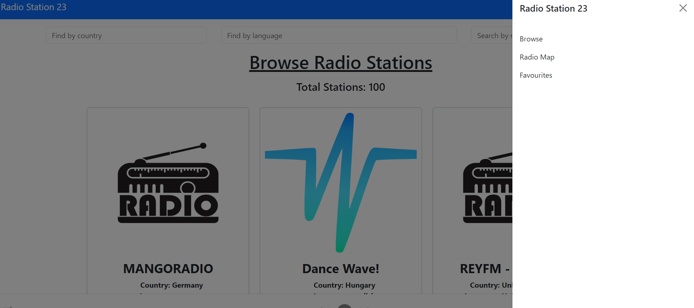

# Radio Station 23

## Key Features:
1. **Radio Station Discovery:** functionality for users to discover and search for radio
stations based on various criteria such as (e.g., country, language, name) and geolocation
map based.
2. **Streaming Playback:** Integrate streaming capabilities to play live radio stations in real-time,
providing uninterrupted audio playback with minimal buffering.
3. Favourite Stations: Allow users to mark and save their favourite radio stations for quick
access and future listening. **[Under Constraction]**
4. **Customizable Player Controls:** Provide user-friendly controls for play, pause, volume
adjustment, as well as options for muting and displaying
station information.
5. **Responsive Design:** Ensure the application is responsive and works well on different screen
sizes and devices, allowing users to listen to their favourite radio stations from desktops,
tablets, and mobile phones.
6. Local Storage: Store user preferences [theme switch dark/light mode] and favourite radio
stations locally using browser's local storage mechanism to ensure persistence across
sessions.  **[Under Constraction]**
7. **For Bonus added the station count**

### Future scope
1. Implimenting the search funtionality
2. Implimenting the favourite section
3. Ensuring better code quality by using **Context API and Custom Hooks**
4. Ensuring using **TypeScript and New version of React JS**
### Screenshots
**Intial Home Page**
 
**Side bar for navigation**

**Map Using Leaflet**
